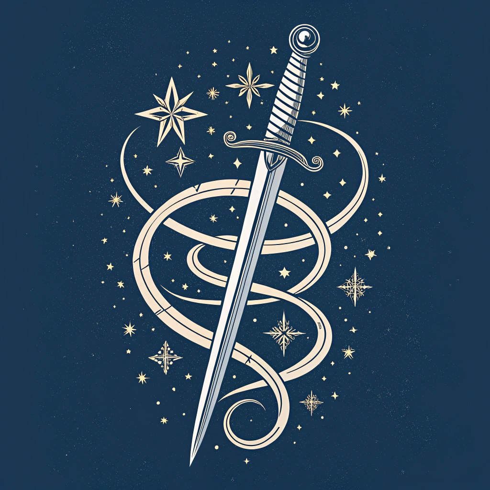

# Simple 5E - Character Manager

<p align="center">
  
</p>

Simple 5E is a streamlined Flutter application designed for Dungeons & Dragons 5th Edition players. It offers an intuitive interface for managing character stats and spells, enhancing your tabletop roleplaying experience.

## Overview

Our goal is to provide an intentionally simple, user-friendly experience for players during their adventures. Simple 5E focuses on core functionality, offering a lightweight alternative to more complex character management apps.


### Key Features:
- Easy character stat tracking
- Intuitive spell management
- Clean, distraction-free interface

While Simple 5E may not replace full-featured 5E apps, it's perfect for players who prefer a minimalist approach to character management.

## Alternative Apps

For those seeking more comprehensive tools, consider these alternatives:

* [the DND Beyond Player App](https://www.dndbeyond.com/player-app)
* [5e Spells (Android)](https://play.google.com/store/apps/details?id=com.dungeondev.a5espells&hl=en-US)
* [5e Spells (iOS)](https://apps.apple.com/us/app/spells-list-5e/id1220380339)

## Suggestions?

If there's any feature that you'd like to see, or bugs that you run into, please submit an issue on github with some details and i'll do my best to address it! 

## Contributing

### Prerequisites

- Flutter SDK (latest stable version)
- Dart SDK
- Android Studio / VS Code

## Building and Running from Source

1. Clone the repository
```bash
git clone https://github.com/Simple-5E/Simple-5E.git
```

2. Install dependencies
```bash
make
```

3. Run the app
```bash
flutter run
```

4. Running unit tests

```bash
make test
```

## License

This project is licensed under the MIT License - see the [LICENSE](LICENSE) file for details.

## Acknowledgements

**Asset Management**

Assets were generated via [Replicate](https://replicate.com/) using the recraft-v3 text-to-image model. If you feel these could be improved, please modify the asset files under the assets folder and submit a PR.

**Development Process**

This pet project utilized Large Language Models (LLMs) to bootstrap many components and widgets. Claude Sonnet was exclusively used with [Continue.dev](https://www.continue.dev/) to assist in the development process.