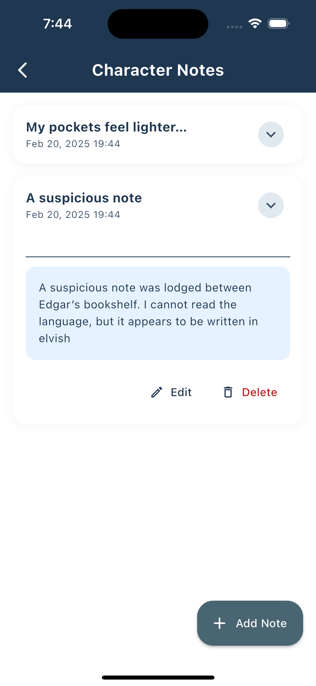

Simple 5E is a simple and intuitive 5E compatible character tracker. Keep track of your characters, abilities and spells across your adventures!

Available now on [Google Play](https://play.google.com/store/apps/details?id=com.murraydev.simple5e)

## Overview

The goal is to provide an intentionally simple, user-friendly experience for players during their adventures. Simple 5E focuses on core functionality, offering a lightweight alternative to more complex character management apps.

<p float="left" align="center">
  
  
  
  
  
</p>

### Key Features:

* Character creation
* Character stat and ability management
* Spell book management
* Ability to add your very own custom races, classes and spells
* Clean, distraction-free interface

## Staying Simple

Simple 5E will never be a fully featured app in favour of remaining light and intuitive. Besides, there are several
great 5E apps out there anyway!

* [the DND Beyond Player App](https://www.dndbeyond.com/player-app)
* [5e Spells (Android)](https://play.google.com/store/apps/details?id=com.dungeondev.a5espells&hl=en-US)
* [5e Spells (iOS)](https://apps.apple.com/us/app/spells-list-5e/id1220380339)

## Short-Term Goals 🚀

- [x] Add character notes functionality
- [ ] Implement custom race image uploads
- [ ] Enable custom class image uploads
- [ ] Expand spell list beyond default 5E spells

## Long-Term Vision 🔮

- [ ] Implement multi-device synchronization
- [ ] Develop a web application version
- [ ] Create a desktop application
- [ ] Enhance in-app theming options

💡 Have a suggestion? Feel free to [open an issue](https://github.com/Simple-5E/Simple-5E/issues/new)!

## Developer Guide

### Prerequisites

- Flutter SDK (latest stable version)
- Dart SDK
- Android Studio / VS Code

## Building and Running from Source

1. Clone the repository
```bash
git clone https://github.com/Simple-5E/Simple-5E.git
```

2. Install dependencies
```bash
make
```

3. Run the app
```bash
flutter run
```

4. Running unit tests

```bash
make test
```

## License

This project is licensed under the MIT License - see the [LICENSE](LICENSE) file for details.

## Acknowledgements

**Asset Management**

Assets were generated via [Replicate](https://replicate.com/) using the recraft-v3 text-to-image model. If you feel these could be improved, please modify the asset files under the assets folder and submit a PR.

**Development Process**

This pet project utilized Large Language Models (LLMs) to bootstrap many components and widgets. Claude Sonnet was exclusively used with [Continue.dev](https://www.continue.dev/) and [Aider](https://aider.chat/) to assist in the development process.
